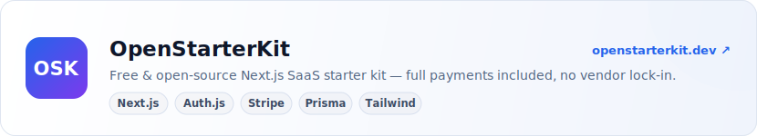

<picture>
  <source media="(prefers-color-scheme: dark)" srcset="images/banner-dark.svg">
  
</picture>

  

**I build open-source tools that help developers ship real SaaS products, fast.**

 

<a href="https://github.com/openstarterkit/nextjs-saas-starter-kit">
  <picture>
    <source media="(prefers-color-scheme: dark)" srcset="images/openstarterkit-card-dark.svg">
    
  </picture>
</a>

⭐ if it saves you time&nbsp;&nbsp;·&nbsp;&nbsp;☕ [if it saves you a lot](https://buymeacoffee.com/openstarterkit)

  

<picture>
  <source media="(prefers-color-scheme: dark)" srcset="https://skillicons.dev/icons?i=nextjs%2Creact%2Cts%2Ctailwind%2Cprisma%2Cpostgres%2Cnodejs%2Cvercel&theme=dark">
  
</picture>

  

<b>Also worked with</b>

<picture>
  <source media="(prefers-color-scheme: dark)" srcset="https://skillicons.dev/icons?i=js%2Cvue%2Cphp%2Claravel%2Cruby%2Crails%2Cpython%2Cflutter%2Cdart%2Csass%2Cbootstrap%2Cmysql%2Cgit%2Clinux&perline=14&theme=dark">
  
</picture>

  

&nbsp;
&nbsp;

