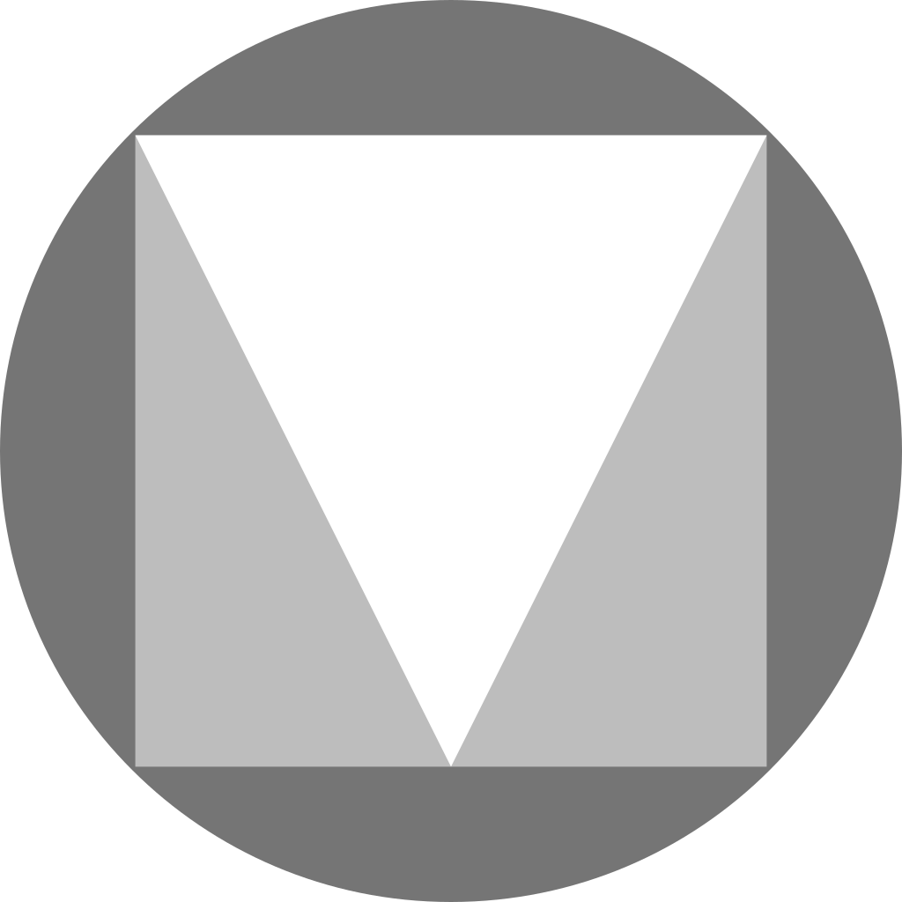

##  

## 🔧 Tools & Technologies
<code></code>
<code></code>
<code></code>
<code></code>
<code></code>
<code></code>
<code></code>
<code></code>
<code></code>
<code></code>
<code></code>
<code></code>
<code></code>
<code></code>
<code></code>
<code></code>
<code></code>
<code></code>
<code></code>
<code></code>
<code></code>
<code></code>
<code></code>
<code></code>
<code></code>
<code></code>
<code></code>
<code></code>
<code></code>
<code></code>

#### [:rocket: => This is my Portfolio](https://michelecanini.github.io)
#### [📫 => How to reach me: Linkedin](https://www.linkedin.com/in/michele-canini-1a71b2134/)

<!---
michelecanini/michelecanini is a ✨ special ✨ repository because its `README.md` (this file) appears on your GitHub profile.
You can click the Preview link to take a look at your changes.
--->
